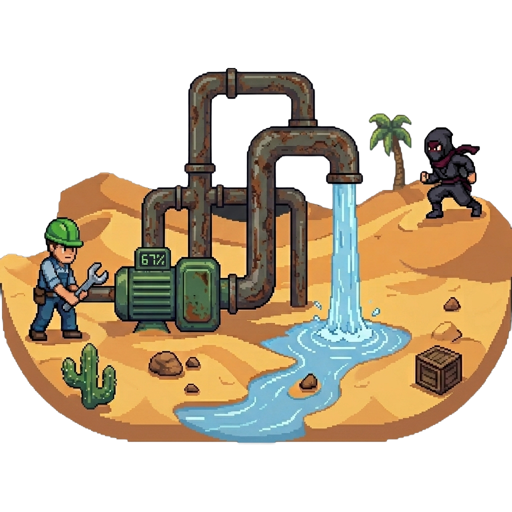
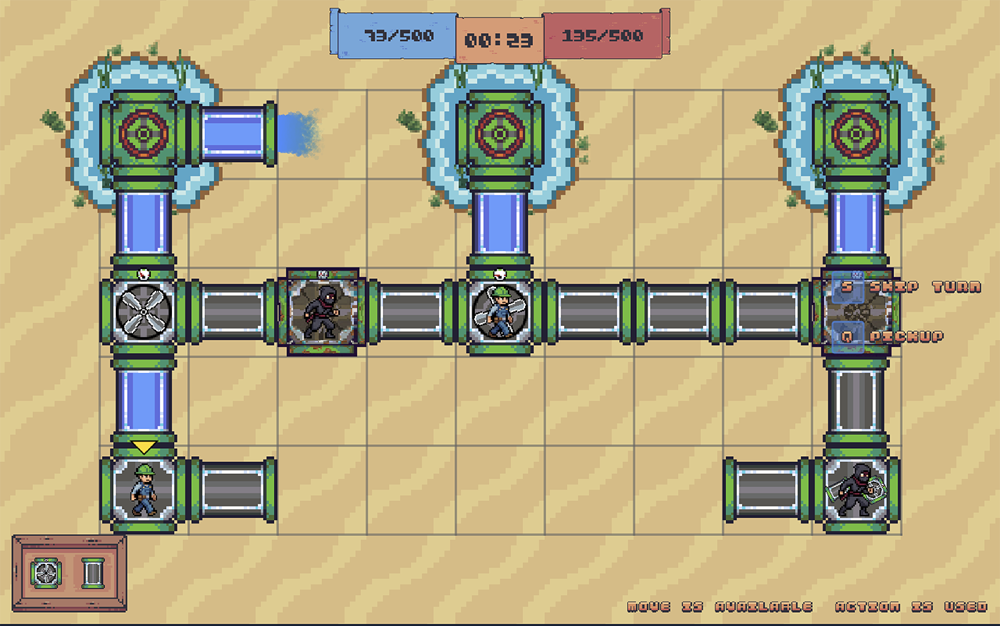

<!-- Source: https://github.com/othneildrew/Best-README-Template/ -->
<a id="readme-top"></a>
<!-- PROJECT LOGO -->
<br />
<div align="center">
  <a href="https://github.com/Avocadic321/sw_proj_lab">
    
  </a>
<h3 align="center">Pipes in the Desert</h3>
  <p align="center">
    A turn‑based strategy game where Plumbers and Saboteurs fight for water in a hostile desert pipeline network.
    <br />
    <a href="https://github.com/Avocadic321/sw_proj_lab/issues/new?labels=bug&template=bug-report---.md">Report Bug</a>
    &middot;
    <a href="https://github.com/Avocadic321/sw_proj_lab/issues/new?labels=enhancement&template=feature-request---.md">Request Feature</a>
  </p>
</div>

<!-- TABLE OF CONTENTS -->
<details>
  <summary>Table of Contents</summary>
  <ol>
    <li><a href="#about-the-project">About The Project</a></li>
    <li><a href="#features">Features</a></li>
    <li>
      <a href="#getting-started">Getting Started</a>
      <ul>
        <li><a href="#prerequisites">Prerequisites</a></li>
        <li><a href="#installable">Installable</a></li>
        <li><a href="#build-and-run">Build and Run</a></li>
      </ul>
    </li>
    <li><a href="#usage">Usage</a></li>
    <li><a href="#license">License</a></li>
  </ol>
</details>

<!-- ABOUT THE PROJECT -->
## 🎯 About The Project

<p align="center">
  
</p>

Pipes in the Desert is a standalone turn-based strategy game developed as a software engineering project at the Budapest University of Technology and Economics. Two asymmetric teams — Plumbers and Saboteurs — battle for control of a fragile water pipeline network in a harsh desert. The Plumbers repair pipes, set pump directions, extend the network, and deliver water to city cisterns. The Saboteurs puncture pipes, flip pump valves, and cause leaks to steal water for their score. Every drop counts. The first team to reach the goal score wins.

Built with Java 21, the game features a turn-based core with configurable turn durations, dynamic water flow simulation through pipes and pumps, a modular pipe network that allows disconnecting, reconnecting, and inserting pumps into existing lines, a deterministic test mode for repeatable testing, a rich graphical interface with interactive map and HUD, and audio feedback with sound effects and background music.

## 🚀 Features
- **Two asymmetric teams** – unique abilities for Plumbers (repair, extend, splice) and Saboteurs (puncture, reroute)
- **Turn‑based with configurable timer** – each turn ends by action completion or time‑out
- **Dynamic water simulation** – water flows through pipes and pumps, respecting capacities, leaks, and free ends
- **Modular pipe network** – disconnect, reconnect, and insert pumps into existing pipes
- **Deterministic test mode** – command‑based input/output for repeatable testing
- **Rich graphical interface** – interactive map, HUD, pause/resume, and game‑over screen
- **Audio feedback** – sound effects and background music


## 📦 Getting Started
### 📋 Prerequisites
- Java 21 or higher
- Maven (or use the included wrapper)

### 📥 Installable
Pre-built packages are available on the GitHub Releases page:  
[https://github.com/Avocadic321/sw_proj_lab/releases](https://github.com/Avocadic321/sw_proj_lab/releases)

Choose your preferred format:

| Platform | Package | How to run / install |
|----------|---------|----------------------|
| **Windows** | `PipesInTheDesert.exe` | Double‑click the installer, then launch from Start Menu. |
| **macOS** | `PipesInTheDesert.dmg` | Open the DMG, drag the app to Applications. |
| **Linux (Debian/Ubuntu)** | `pipes-in-desert_1.0_amd64.deb` | Run `sudo dpkg -i pipes-in-desert_*.deb` |
| **Any OS with Java 21+** | `pipes-in-desert.jar` | Run `java -jar pipes-in-desert.jar` |

> **Tip:** The `.jar` file works on any platform where Java 21 is installed, but the native installers provide a more integrated experience (desktop shortcuts, file associations, etc.).

### ⚙️ Build and Run
1. Clone the repository:
    ```bash
    git clone https://github.com/Avocadic321/sw_proj_lab.git
    ```
2. Enter the project folder:
    ```bash
    cd sw_proj_lab/pipes-in-desert
    ```
3. Build the project with Maven:
    ```bash
    mvn clean install
    ```
4. Run the application:
    ```bash
    mvn exec:java
    ```

## 🛠️ Usage
* <kbd>ESC</kbd> or <kbd>P</kbd>: Pause / resume the game
* <kbd>S</kbd>: Skip / end current turn
* <kbd>F</kbd>: Perform player action (repair for Plumber / sabotage for Saboteur)
* <kbd>D</kbd>: Open pump direction overlay
* <kbd>Q</kbd>: Open cistern pickup overlay (Plumber only)
* <kbd>M</kbd>: Split pipe and insert pump (splice)
* <kbd>R</kbd>: Rotate dragged pipe
* <kbd>E</kbd>: Toggle pickup mode

## 📄 License
Distributed under the MIT License. See `LICENSE.txt` for more information.

<p align="right">(<a href="#readme-top">back to top</a>)</p>